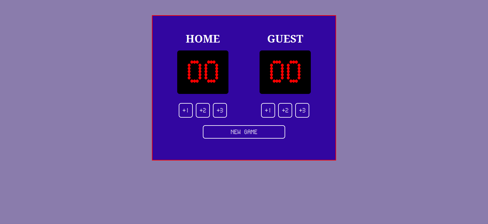
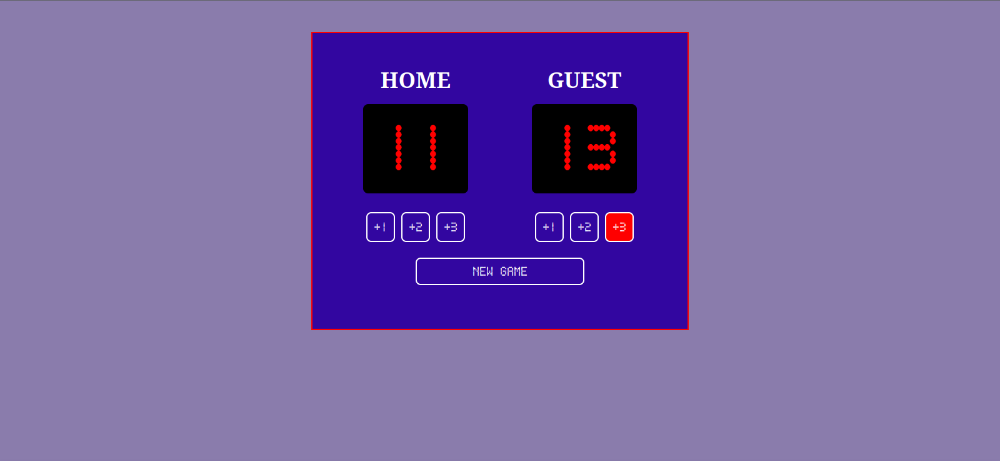

<h1>Marcador digital</h1>

  

 
Ejercicio de clase: 
 

  

 

Un proyecto de clase donde se pide realizar un marcador tipo basketball 
Se usa tecnologias Js,html,css e importar fonts 
Tambien tiene un boton de restart.   
Es responsive. 🧮
 

<h3>ALGUNAS IMAGENES </h3>   
<h4 align= "left"> 🔵 Tablero </h4>   
     
  <h4 align= "left"> 🔵 Como se ven los numeros al sumar y el hover de los botones</h4>   
    

  
 
 
<h6>Gracias por visitar el repo 🥳 </h6>
